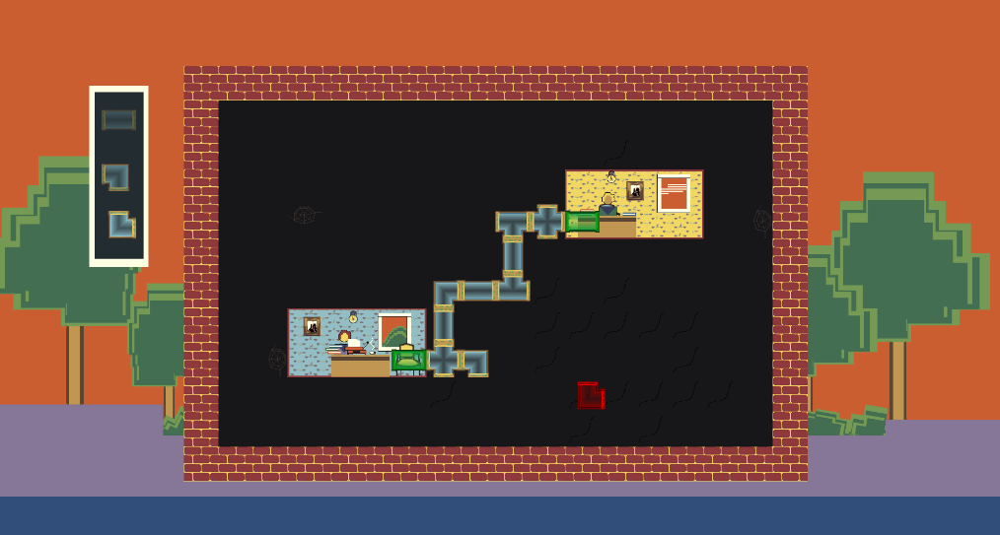

PNEUMADNESS
===========

You are the pipe adminitrator of the central administration, responsible for the pneumatic pipe network. You must connect every office to allow employees to communicate their plentiful admnistrative form to their colleagues. Because of restrictions on its budget, the central administration does not provide the right pipe for every specific connection. You have to manage with what you have at the moment.
Hurry hup! Administrative form are waiting to be stamped and store.

Pneumadness is a game created during the Global Game Jam 2018 by :
* [Sinsem](https://twitter.com/Sinsem_) (Game Design, level design, arts)
* [SporadicFoobar](https://twitter.com/SporadicFoobar) (Game design, code) 
* [Wildphinn](https://twitter.com/Wildphinn) (Game Design, Sound design)
* [FunkyFrog](https://twitter.com/VincentBeauzee) (Game design, arts, code)
* And with help from ["Un peu pointu"](https://www.youtube.com/channel/UCj2sb4hak2L_UpW-1AQ6Qhw/featured)

Code source, assets are in Creative Commons license (according to the Global Game Jam rules).